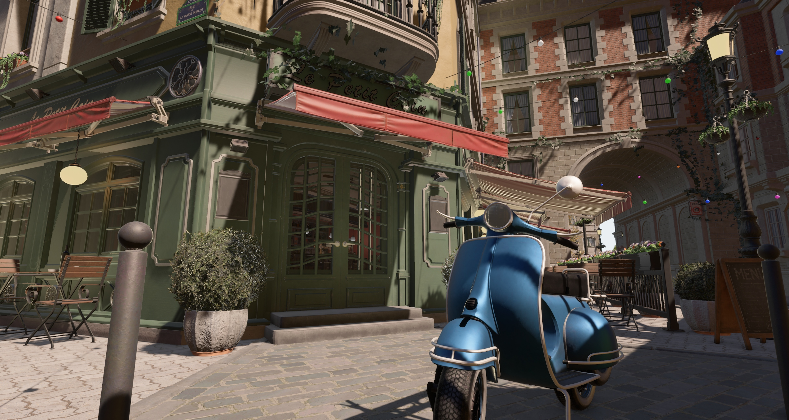

# Bevy Bistro Example

Download scene from https://developer.nvidia.com/orca/amazon-lumberyard-bistro (or see link below for processed glTF files with instancing)

Reexport BistroExterior.fbx and BistroInterior_Wine.fbx as GLTF files (in .gltf + .bin + textures format). Move the files into the respective bistro_exterior and bistro_interior_wine folders.

- Press 1, 2 or 3 for various camera positions.
- Press B for benchmark.
- Press to animate camera along path. 

To optionally convert the textures to KTX2 use: `cargo run -- --convert`. You need [kram](https://github.com/alecazam/kram) in your path to do this. It will convert all the textures to BC7 KTX2 zstd 0 using `available_parallelism()` and update the gltf files to use the KTX2 textures.

[Alternate processed files with instancing (glTF files on discord):](https://discord.com/channels/691052431525675048/1237853896471220314/1237859248067575910)

- Fixed most of the metallic from fbx issue by using a script that makes everything dielectric unless it has metal in the name of the material
- Made the plants alpha clip instead of blend
- Setup the glassware/liquid materials correctly
- Mesh origins are at individual bounding box center instead of world origin
- Removed duplicate vertices (There were lots of odd cases, often making one instance not match another that would otherwise exactly match)
- Made the scene use instances (unique mesh count 3880 -> 1188)
- Removed 2 cases where duplicated meshes were overlapping
- Setup some of the interior/exterior lights with actual sources
- Setup some basic fake GI
- Use included scene HDRI for IBL
